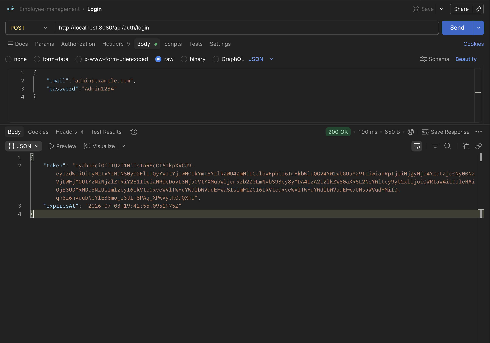

# Employee Management API

Prueba técnica para .NET Backend Developer. API RESTful en ASP.NET Core sobre PostgreSQL, con autenticación JWT, autorización por roles y arquitectura limpia.

## Stack

- .NET 10 (LTS) + ASP.NET Core Web API
- Entity Framework Core 10 + `Npgsql.EntityFrameworkCore.PostgreSQL`
- PostgreSQL 16 (imagen `postgres:16-alpine`)
- ASP.NET Core Identity + JWT (`Microsoft.AspNetCore.Authentication.JwtBearer`)
- Swashbuckle (Swagger UI)
- xUnit + Moq (tests unitarios)
- Docker + docker-compose

> Nota sobre versión: el enunciado no especifica versión de .NET. Se usó .NET 10 (última LTS disponible al momento). Todo compila y ejecuta sin cambios sobre .NET 8/9 salvo actualizar el `TargetFramework`.

## Arquitectura

**Clean Architecture** con 4 proyectos, dependencias hacia adentro:

```
src/
├── EmployeeManagement.Domain/          # Entidades y enums, sin dependencias externas
├── EmployeeManagement.Application/     # Interfaces, DTOs, servicios, patrones
├── EmployeeManagement.Infrastructure/  # EF Core, repositorios, Identity, JWT
└── EmployeeManagement.Api/             # Controllers, middleware, composición
tests/
└── EmployeeManagement.Tests/           # xUnit + Moq
```

Reglas: `Api → Infrastructure → Application → Domain`. `Domain` no depende de nada.

## Patrones aplicados (excluyen Singleton)

1. **Strategy** — `IBonusStrategy` con `RegularEmployeeBonusStrategy` (10%), `ManagerBonusStrategy` (20%) y `SeniorManagerBonusStrategy` (25%). Añadir un nuevo tipo de manager es sólo una clase nueva y un registro DI (OCP).
2. **Factory** — `BonusCalculatorFactory : IBonusCalculator` recibe todas las estrategias vía `IEnumerable<IBonusStrategy>` y selecciona la correcta según `Employee.CurrentPosition`.
3. **Repository** — `IEmployeeRepository` desacopla la capa de aplicación de EF Core. La implementación (`EmployeeRepository`) vive en Infrastructure.

Registro DI (`InfrastructureRegistration`):

```csharp
services.AddScoped<IBonusStrategy, RegularEmployeeBonusStrategy>();
services.AddScoped<IBonusStrategy, ManagerBonusStrategy>();
services.AddScoped<IBonusStrategy, SeniorManagerBonusStrategy>();
services.AddScoped<IBonusCalculator, BonusCalculatorFactory>();
services.AddScoped<IEmployeeRepository, EmployeeRepository>();
```

## SOLID en la solución

- **S**: `EmployeeService`, `BonusCalculatorFactory`, cada strategy, cada `IEntityTypeConfiguration<T>` tienen una única razón de cambio.
- **O**: agregar una nueva estrategia de bono no toca código existente, sólo suma una clase.
- **L**: cualquier `IBonusStrategy` es intercambiable en la factory.
- **I**: interfaces enfocadas (`IEmployeeRepository`, `IBonusCalculator`, `IJwtTokenService`, `IAuthService`).
- **D**: los controllers dependen de abstracciones (`IEmployeeService`, `IAuthService`), no de implementaciones.

## Requisitos

- Docker + Docker Compose (necesario)
- .NET SDK 10.0+ (sólo si vas a correr los tests sin Docker)

## Ejecución con Docker

```bash
docker compose up --build
```

Levanta dos contenedores:
- `employees-db` → `postgres:16-alpine`, expuesto en `5432`.
- `employees-api` → API en `http://localhost:8080`.

Al arrancar, la API aplica migraciones automáticamente y siembra:
- Roles `Admin` y `User`.
- Usuario admin (`admin@example.com` / `Admin1234`).

Swagger UI: `http://localhost:8080/swagger`

## Flujo de uso

```bash
# 1. Login como admin
curl -X POST http://localhost:8080/api/auth/login \
  -H "Content-Type: application/json" \
  -d '{"email":"admin@example.com","password":"Admin1234"}'
```

```bash
# Guarda el token. Luego:
TOKEN="<token-obtenido>"

# 2. Crear empleado (requiere rol Admin)
curl -X POST http://localhost:8080/api/employees \
  -H "Authorization: Bearer $TOKEN" \
  -H "Content-Type: application/json" \
  -d '{"name":"Ada Lovelace","currentPosition":2,"salary":5000,"departmentId":null}'

# 3. Listar empleados (Admin o User)
curl http://localhost:8080/api/employees -H "Authorization: Bearer $TOKEN"

# 4. Registrar usuario con rol User
curl -X POST http://localhost:8080/api/auth/register \
  -H "Content-Type: application/json" \
  -d '{"email":"user@example.com","password":"User1234"}'
```

`currentPosition`: 1 = Regular (10%), 2 = Manager (20%), 3 = SeniorManager (25%).

## Tests

```bash
dotnet test
```

Cubre: strategies, factory y `EmployeeService` (con mocks de repository y bonus calculator).

## Base de datos

Tablas (todas gestionadas por EF Core migrations):

- `employees` (Id, Name, CurrentPosition, Salary, DepartmentId)
- `position_history` (Id, EmployeeId, Position, StartDate, EndDate)
- `departments` (Id, Name)
- `projects` (Id, Name, StartDate, EndDate)
- `employee_projects` (tabla puente m2m)
- Tablas de Identity: `AspNetUsers`, `AspNetRoles`, `AspNetUserRoles`, etc.

### Query LINQ pedida (sección 4.3)

`EmployeeRepository.GetByDepartmentWithProjectsAsync`:

```csharp
return await _context.Employees
    .Include(e => e.Projects)
    .Where(e => e.DepartmentId == departmentId && e.Projects.Any())
    .AsNoTracking()
    .ToListAsync(ct);
```

## Endpoints

| Método | Ruta                    | Roles       |
| ------ | ----------------------- | ----------- |
| GET    | `/api/employees`        | Admin, User |
| GET    | `/api/employees/{id}`   | Admin, User |
| POST   | `/api/employees`        | Admin       |
| PUT    | `/api/employees/{id}`   | Admin       |
| DELETE | `/api/employees/{id}`   | Admin       |
| POST   | `/api/auth/register`    | anónimo     |
| POST   | `/api/auth/login`       | anónimo     |

## Respuestas a las preguntas textuales de la prueba

### 2.2 — Autenticación y autorización

Se usa ASP.NET Core Identity para gestión de usuarios/roles (persistidos con EF Core sobre PostgreSQL) y JWT Bearer para autenticación stateless.

Al arranque se registra el esquema Bearer con:

```csharp
builder.Services
    .AddAuthentication(JwtBearerDefaults.AuthenticationScheme)
    .AddJwtBearer(options =>
    {
        options.TokenValidationParameters = new TokenValidationParameters
        {
            ValidateIssuer = true,
            ValidateAudience = true,
            ValidateLifetime = true,
            ValidateIssuerSigningKey = true,
            ValidIssuer = jwtOptions.Issuer,
            ValidAudience = jwtOptions.Audience,
            IssuerSigningKey = new SymmetricSecurityKey(Encoding.UTF8.GetBytes(jwtOptions.Key))
        };
    });
```

La autorización se aplica de forma declarativa por controller/action con `[Authorize(Roles = "...")]`. El `JwtTokenService` inyecta el claim `role` en el token; el middleware de autorización lo evalúa contra los atributos.

### 2.3 — Middleware

Un middleware en ASP.NET Core es un componente que participa en el pipeline de procesamiento de cada request HTTP. Cada componente puede: (a) inspeccionar/modificar la request, (b) invocar al siguiente componente vía `RequestDelegate`, (c) inspeccionar/modificar la response. Se registran en orden en `Program.cs`; el orden importa (por ejemplo, `UseAuthentication` va antes de `UseAuthorization`).

Este proyecto incluye `RequestLoggingMiddleware` (`src/EmployeeManagement.Api/Middleware/RequestLoggingMiddleware.cs`) que registra método, ruta, status code, duración en ms y el `correlationId` (TraceIdentifier) de cada request.

### 5.1 — Problemas comunes de performance en .NET

- **Consultas N+1** con EF Core → usar `Include`/proyecciones explícitas.
- **Falta de `AsNoTracking()`** en lecturas → EF crea entidades tracked innecesariamente.
- **Materializar toda la tabla** (`.ToList()` antes de `.Where()`) → filtrar en el servidor SQL.
- **Bloqueo síncrono en I/O** → usar `async/await` de punta a punta.
- **Overhead del garbage collector** por allocaciones grandes → `Span<T>`, `ArrayPool<T>`, pooling.
- **Serialización JSON pesada** → `System.Text.Json` en lugar de `Newtonsoft.Json`, source generators.
- **Falta de cache** para lecturas frecuentes → `IMemoryCache` / `IDistributedCache`.
- **Reflection en hot paths** → cachear delegados compilados o compiled expressions.

### 5.2 — Profiling y optimización de una query lenta

1. **Reproducir y medir**: capturar el SQL real con `EnableSensitiveDataLogging()` en desarrollo o mediante `IDbCommandInterceptor` en producción.
2. **`EXPLAIN (ANALYZE, BUFFERS)`** en PostgreSQL para ver plan de ejecución, si hay `Seq Scan` en tablas grandes o hash joins costosos.
3. **Índices** en columnas de filtro (`WHERE`) y de join. Compuestos si el filtro es multi-columna.
4. **`AsNoTracking()`** en lecturas de sólo lectura.
5. **Proyección** a un DTO con `.Select(...)` para leer sólo las columnas necesarias.
6. **Paginación** obligatoria (`Skip/Take`).
7. **`AsSplitQuery()`** cuando se hacen múltiples `Include` que causan un cartesian explosion.
8. **Cache** de resultados si aplica.
9. **APM/Perfilado** (MiniProfiler, dotTrace, Application Insights) para localizar hotspots.
10. Si la query es puntual y compleja: usar un stored procedure o `FromSqlRaw` como último recurso.
